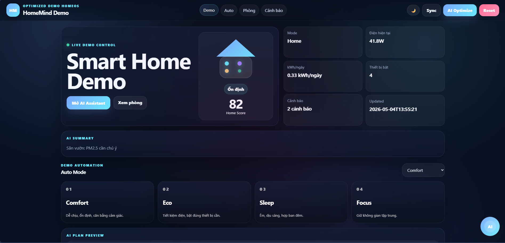
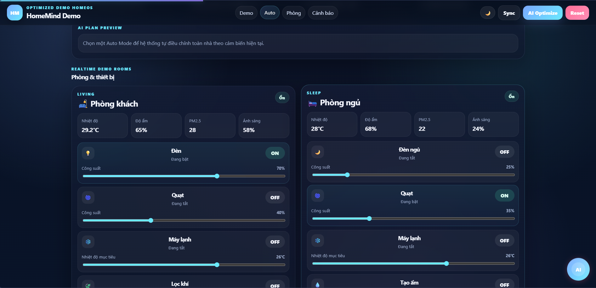
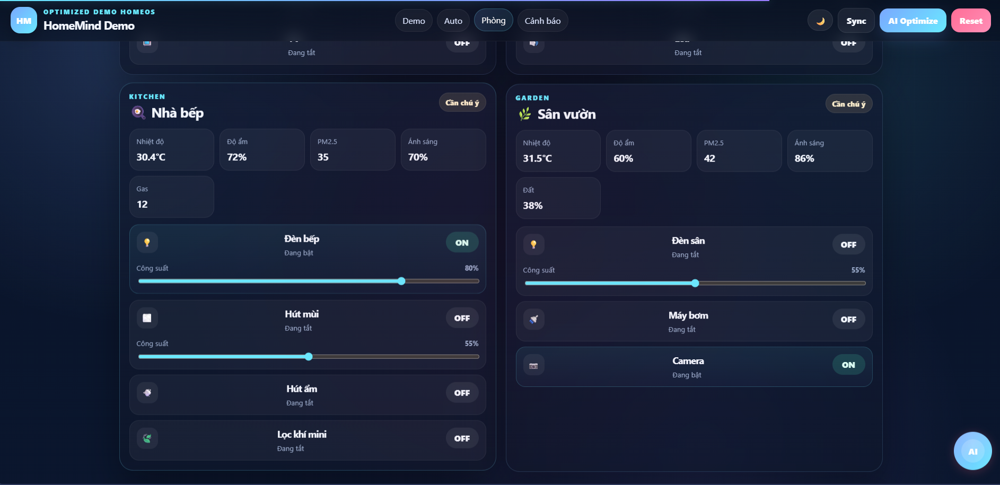
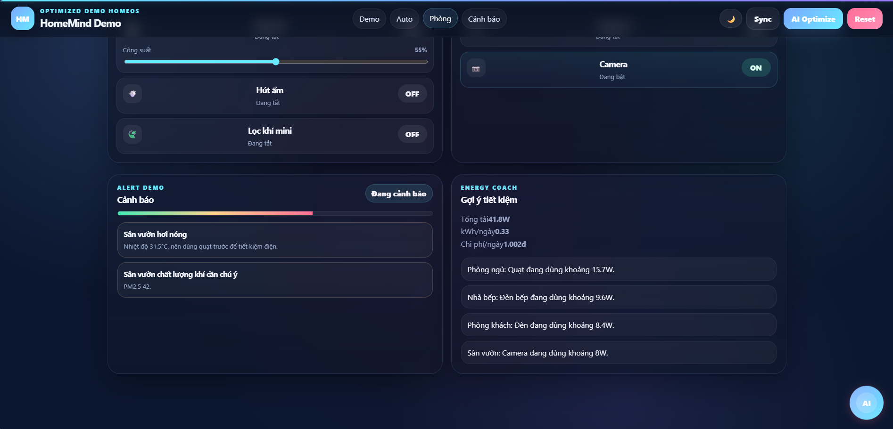
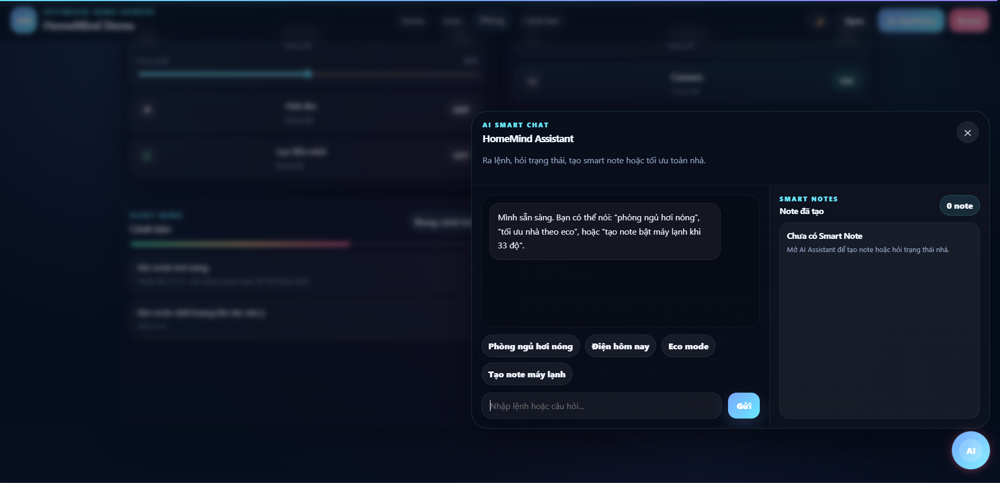
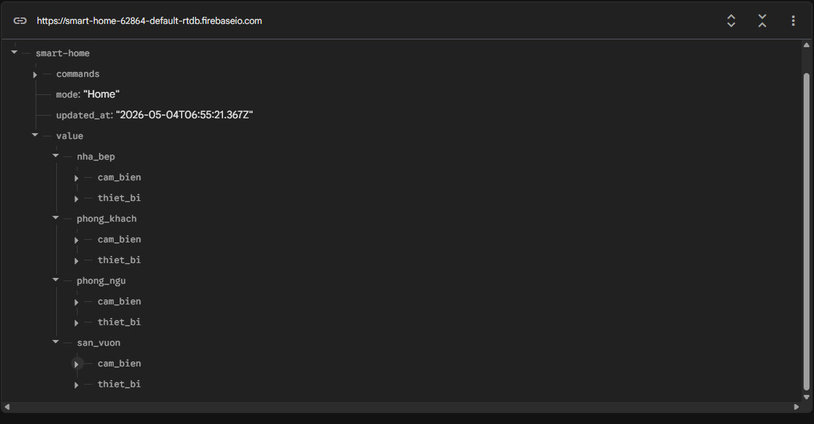

---

## Key Features

- Realtime monitoring for temperature, humidity, PM2.5 and room status
- Smart device control through Firebase Realtime Database
- Web dashboard for monitoring and controlling devices
- Automation logic based on sensor conditions
- AI Smart Chat for natural language interaction
- Smart Notes automation system
- Alert-based UI reactions for abnormal conditions
- Dark / Light mode dashboard
- Energy usage estimation and optimization suggestions

---

## Tech Stack

| Layer | Technologies |
|---|---|
| **Embedded / IoT** | ESP32, Arduino, C/C++, Sensors, Relay Module |
| **Realtime Database** | Firebase Realtime Database |
| **Backend** | Python, FastAPI, REST API |
| **Frontend** | HTML, CSS, JavaScript |
| **AI-assisted Features** | Local AI / Ollama, Smart Notes, Natural Language Commands |

---

## Demo Screenshots

### Dashboard Preview

| Overview | Automation |
|---|---|
|  |  |

| Room Control | Alert / AI Summary |
|---|---|
|  |  |

### AI Chat Preview

### Firebase Sync Preview

## Demo Video

A short demo video showing the main workflow of the HomeMind AI Smart Home Dashboard.

The demo includes:

- Firebase Realtime Database synchronization
- Realtime dashboard monitoring
- Smart device control
- Auto Mode automation
- AI Assistant interaction
- Smart Notes automation

[Watch Demo Video](https://drive.google.com/file/d/1gaampTVrBAsVZE6X8f8OjjAExAJHJfi5/view?usp=sharing)
